# Note-by-Note user guide

Note-by-Note is a mod for Rocksmith 2014: the song waits at each note and chord until you play it, and the screen tells you what to play, how, and what comes next. This guide explains everything it puts on screen and every option in its menu.

The pictures are drawings, not screenshots. Their notes, chords and song parts are made-up examples, so each picture can show exactly the case it explains.

Most of what is described here can be changed. Where it can, the guide names the option and the menu page it is on, like this: ("Late notes count", Playing page). The menu opens with F8, and [The menu](#the-menu) lists every option.

## What you see on screen

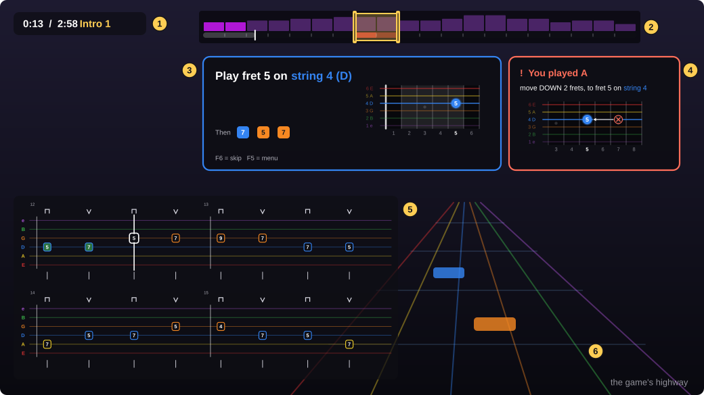

1. **The clock**: the song's time, its length, and the part of the song you are in ("Intro 1", "Chorus 2"). ("Song time", Screen page.)
2. **The practice bar**, on the game's own progress bar: mark the parts of the song you want to practise, and see in red where you stop most. ("Practice bar", Screen page.)
3. **The banner**: the note or chord to play, and what comes after it. It has two looks: words with a fretboard, or cards. ("The note to play (the banner)" and "Look", Screen page.)
4. **The wrong-note panel**: appears beside the banner after a wrong note and says how to fix it. It comes with the banner: there is no switch of its own.
5. **The tab**: the music coming up, written as guitar tab, with a cursor that follows the song. ("Show the notes coming up as tab", Tab page.)
6. The game's highway, as always. Note-by-Note draws on top of the game and changes nothing in it.

Each part can be moved and resized with the mouse while the menu is open (see [Moving and resizing](#moving-and-resizing)).

## Getting started

1. Install it with `Note-by-Note Setup.exe` (the README that comes with it has the steps) and start the game as usual.
2. Open a song in **Learn a Song**. When the song starts you see the message "Note-by-Note ON - F8 menu".
3. Play. When a note reaches the line and you have not played it, the song stops and the banner shows that note. Play it and the song goes on.

Two keys are all you need:

| Key | What it does |
|---|---|
| **F8** | Opens and closes the Note-by-Note menu. The song is held while the menu is open. |
| **F9** | Skips the note or chord the song is waiting for. |

Both keys can be changed, in the settings file only (`MenuKey` and `SkipKey`, see [Files](#files)).

Note-by-Note follows the game: it uses the arrangement you chose (lead, rhythm or bass) and the difficulty level the game is showing you. If the game gives you fewer notes, Note-by-Note waits for fewer notes.

## The three modes

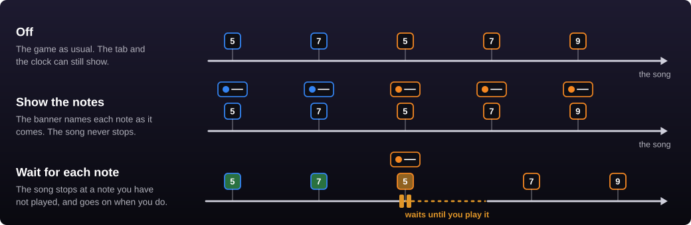

You choose the mode at the top of the menu (F8).

- **Wait for each note**: the song stops at every note you have not played, music and highway together, and goes on the moment you play it. Notes you play on time do not stop anything. It waits for chords as well as single notes; to let chords pass by themselves, switch off "Wait for chords too" (Playing page).
- **Show the notes**: the song plays as usual and never stops. The banner names each note as it comes and moves on as the song passes it. Use it when you can nearly keep up and want the banner as a guide.
- **Off**: the game plays as usual. The tab and the clock still show if they are switched on.

### When a note counts

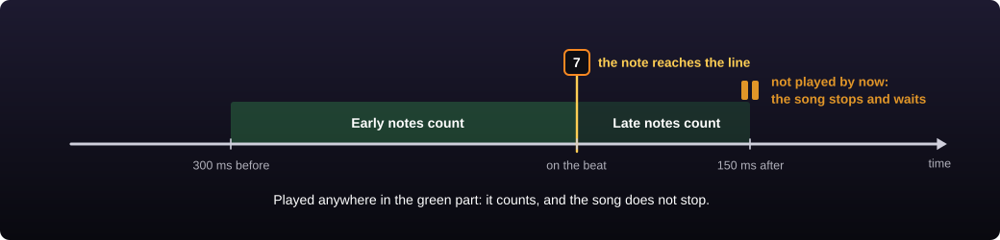

The song does not stop for a note you played a little early or a little late. A right note counts from 300 ms before its time until 150 ms after it. Only if you have not played it by then does the song stop and wait. Both lengths can be changed ("Early notes count", 0 to 1000 ms, and "Late notes count", 0 to 400 ms, Playing page).

That late part matters: a note played right on the beat is heard a moment after its time, so without it the song would stop for an instant at every note. If the song still stops when you play on the beat, make "Late notes count" longer; if you want it stricter, make it shorter. At 0 the song stops just before each note you have not played yet, even one you were about to play on the beat (how long before: "Stop before the note", Playing page).

Only the note the song asks for counts. To also accept the same note an octave higher or lower, for example when you play a riff in another place on the neck, switch on "Accept the same note an octave higher or lower" (Playing page).

After a long wait (more than 2 seconds) the song does not jump straight back in: it counts 3 beats at its own tempo, with big numbers on screen, so you find the beat again. You can change how many beats it counts, from 1 to 4, or set it to 0 to switch the count-in off ("Count-in after a wait", Playing page).

## The banner as words and a fretboard

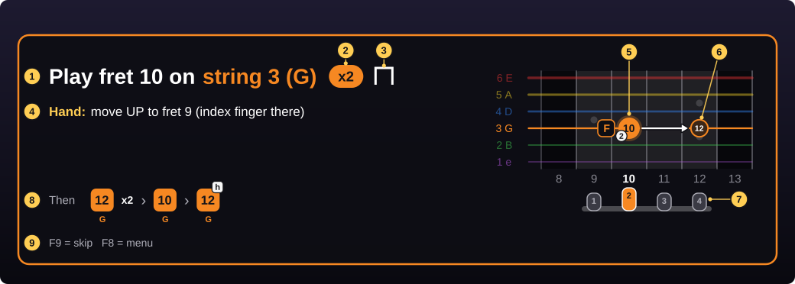

The banner stays in one place and keeps its size from note to note. Only its colours, words and dots change. Its frame has the colour of the string to play. Where it sits and how big it is are yours to choose (see [Moving and resizing](#moving-and-resizing)).

A new install shows the plain banner: what to play (1), the repeat counter (2), how to play it (4) and the note on the fretboard (5). The picture also shows the extras, which start switched off: the pick stroke (3), the fingers and hand position (the hand's line in 4, the finger numbers in 5, and 7), the next note (6) and the "Then" row (8). The brackets after each item name the option that switches it on.

1. **What to play**: the fret and the string. Strings are named by number and letter, "string 3 (G)", in the string's colour on the highway. (Which string is number 1: "Number the strings from the thickest", Tab page.)
2. **The repeat counter**: the same note comes several times in a row. It counts down as you play them.
3. **The pick stroke**: a bracket means pick down, a V means pick up. ("Show which way to pick", Tab page: it switches the sign on the banner, the cards and the tab together.)
4. **How to play it**: one line for each thing to do. Here the hand has to move, and the line says where. Techniques (slide, bend, hammer-on...) get their line here too. (The hand's line: "Fingers and hand position", Screen page.)
5. **The note on the fretboard**: a dot in the string's colour with the fret number inside. The small white number is the finger to use, and the tag beside the dot is the note's name. (A small tab instead of the fretboard: switch off "Show it on a fretboard". The finger numbers: "Fingers and hand position". Both on the Screen page.)
6. **The next note**: a fainter ring, with an arrow from the note you are on. (Shown while "Notes shown ahead" is 1 or more, Screen page.)
7. **Your hand**: the frets it covers are shaded on the fretboard. Under it, four fingers sit over those frets, and the one playing now is in colour. (The shading: "Fingers and hand position". The fingers under the fretboard: "Draw the hand under the fretboard". Both on the Screen page.)
8. **The "Then" row**: the notes that follow, in order. Each is a square in its string's colour with the fret number and the string's letter under it. A small tag is its technique, "x2" means it is played twice. (How many notes it shows: "Notes shown ahead", 0 to 5, Screen page. At 0 the row is gone.)
9. **The keys**, as a reminder.

The fretboard keeps showing the same frets while your hand stays in place. It moves only when a note does not fit, like a camera following your hand.

### Chords

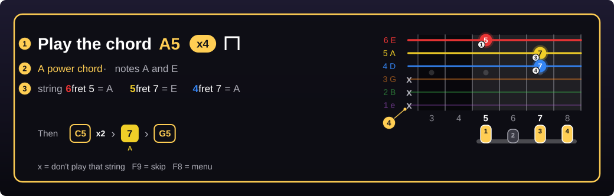

A chord's banner is gold.

1. **The chord's name**, as the song writes it, with the repeat counter and the pick stroke.
2. **What the chord is**, in words, and the notes in it.
3. **Each string to play**: its number in the string's colour, its fret, and the note it gives.
4. **x** marks a string you must not play.

When a chord has no name in the song (two notes together, for example) the banner says "Play these strings together".

### Techniques, long notes and held shapes

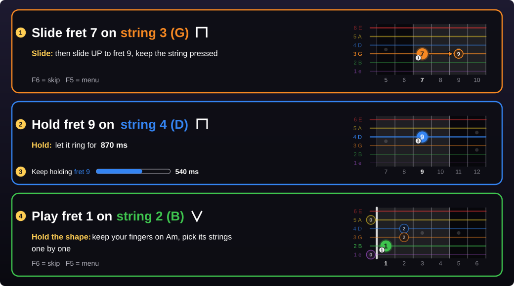

1. **A technique changes the first word.** Instead of "Play" the banner says "Slide", "Bend", "Hammer-on" and so on, and a line under it says how in plain words. The fretboard draws it too: here an arrow to the fret the slide ends on.
2. **A long note says "Hold"**, and how long to let it ring.
3. **Once you have played a long note**, the last line becomes a countdown: keep holding until the bar is empty.
4. **A held chord shape**: the song keeps a chord pressed while its strings are picked one by one. The banner says "Hold the shape" and shows the chord's other fingers as faint rings around the note to play.

What the banner says for each technique:

| First word | The banner's explanation |
|---|---|
| Hammer-on | don't pick: hit the fret hard with a finger of your fretting hand |
| Pull-off | don't pick: pull your finger off the string so it sounds |
| Tap | hit the fret with a finger of your picking hand |
| Slide | then slide UP (or DOWN) to the fret it names, keep the string pressed |
| Bend | push the string sideways until it sounds half a step, a step... higher |
| Vibrato | shake the note a little while it rings |
| Palm mute | rest the side of your picking hand on the strings, near the bridge |
| Mute | touch the string without pressing it down: just a dull click |
| Harmonic | touch the string right over the fret wire, don't press it down |
| Pinch harmonic | let your thumb graze the string as you pick it |
| Tremolo | pick it very fast, again and again |
| Accent | play it louder than the others |
| Slap, Pop | bass: hit the string with the side of your thumb; hook it with a finger and let it snap back |
| Hold | a long note: let it ring for the time shown |

When a note has several steps (a vibrato that ends in a slide), the lines are numbered in the order to do them.

## The banner as cards

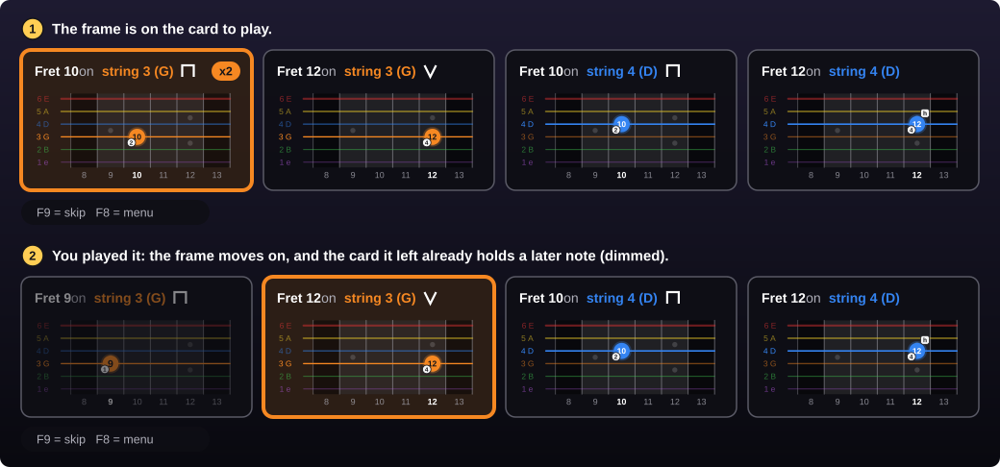

The cards look has no sentences, no small tab and no hand under the fretboard: those options only apply to the words look. Each note or chord is a card with its name and a small fretboard, and you read them from left to right. It is for when you already know the words and want to see further ahead.

1. **The frame marks the card to play.** The cards themselves do not move.
2. **When you play it, the frame moves to the next card.** The card it left is filled at once with a later note, dimmed, and waits there until the frame comes round again. So nothing jumps while you play, even in fast parts: only the frame moves, like the cursor over the tab.

After the last card, the frame goes back to the first one. When the banner has gone away for a while (the end of a practice part, a long rest), the next notes start again from the first card.

Choose the look with "Look" (Screen page). "Notes shown ahead" (Screen page) sets how many notes follow the one to play, 0 to 5, in both looks (it starts at 0, and choosing Cards sets it to 3 if it was 0), so there are that many cards plus one (fewer if the screen is too narrow for them). A quick repeat of the same note counts as one.

### A note played several times

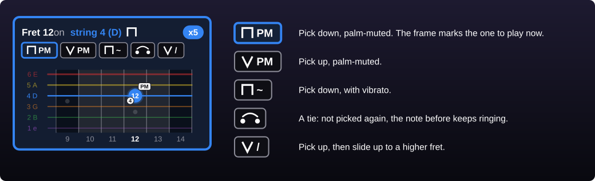

When the same note is played several times in a row, the card shows the counter ("x5") and, under the name, one small cell for each time. That way you see before you get there that the picking or the technique changes from one to the next. The frame is on the cell to play now, and the cells you have played fade.

A card only shows the cells when they are worth reading: when the repeats differ in pick stroke or technique, or when they carry a mark.

## Strings, fingers and marks

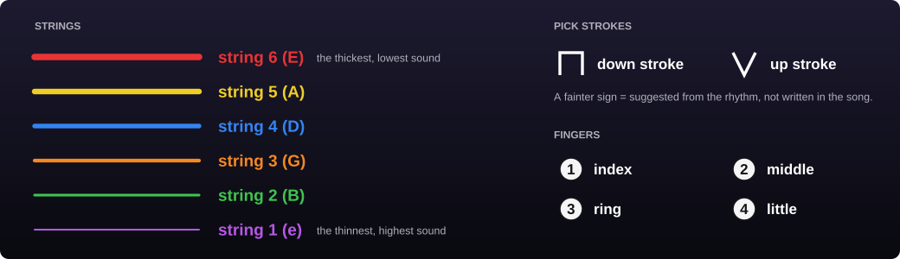

- **Strings** have the game's colours. They are numbered as in guitar books: string 1 is the thinnest, string 6 the thickest. If you prefer to count from the thickest, switch on "Number the strings from the thickest" (Tab page).
- On the banner's fretboard the thickest string is on top, as you see the neck when you look down at it and as the highway shows it. The tab has the thinnest on top, as printed tab does ("Thickest string on top", Tab page, flips the tab).
- **Pick strokes** come from the song when it has them. Few songs do, so otherwise they are suggested from the rhythm the way alternate picking is taught: down on the beat, up in between. Notes that are not picked (hammer-ons, pull-offs, taps) get none. ("Show which way to pick", Tab page.)
- **Fingers** are numbered 1 (index) to 4 (little finger). ("Fingers and hand position", Screen page.)

### The marks

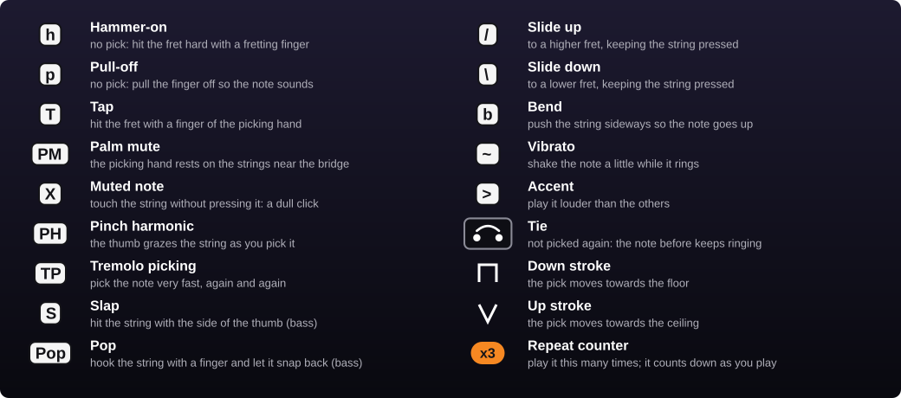

The same marks are used on the cards, in the "Then" row, on the fretboard's dots and on the tab. They are the usual ones of printed tab and of tab sites, so what you learn here you can read anywhere.

Two of them are easy to mix up: **PM** is a palm mute (the picking hand damps the strings, the note still has its pitch), **X** is a muted note (the fretting hand only touches the string, you hear a click).

On the tab, three things are drawn instead of written: a slide is a slanted line after the fret number, a bend is an arrow up with how far to bend ("1/2", "1"), and a harmonic has the fret number between pointed brackets.

## Wrong notes

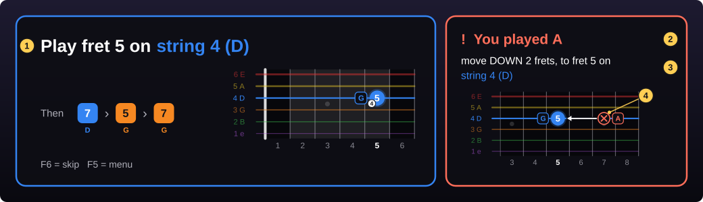

1. **The banner does not change.** It keeps showing what to play.
2. **The panel names what it heard**: "You played A". For a chord it says "Not quite".
3. **How to fix it**, in words.
4. **Where you probably played it**: a red X on the fretboard, with an arrow to the right spot.

The panel sits beside the banner and follows it. On a screen with no room beside the banner (most 16:9 screens) it goes under the banner, next to the tab. It is always drawn over the tab and the clock, so nothing hides it. You can also drag it to another place and resize it (with the menu open, see "Moving and resizing").

The advice depends on the mistake:

| What happened | What the panel says |
|---|---|
| Right string, wrong fret | move UP 2 frets, to fret 7 on string 3 (G) |
| Right fret, wrong string | that's string 4 (D), use fret 7 on string 3 (G) |
| The right note in another octave | right note, but an octave too high: play fret 7 on string 3 (G) |
| A fret pressed where the string should be open | don't press any fret: play string 3 (G) open |
| A chord with one finger off | string 3 (G) is 1 fret too high: move DOWN to fret 2 |
| A chord with a string that does not sound | not sounding: string 2 (B) at fret 1 - press firmly and strum every string |
| A chord with a string that should stay silent | a note that isn't in the chord is ringing (F#): don't strum the x strings |

### Showing where you really played it

The same note exists in several places on the neck, so from the note alone Note-by-Note can only guess where your finger was. It can do better: a thicker string sounds a little different, and from that it tells which string you played and shows only that spot.

This is "Show where you really played it" (Playing page); switched off, the panel always shows its guess. It needs to hear your guitar once: on the same page, press **Calibrate** and pluck each open string 3 times, letting each one ring. Use a clean sound (no distortion or effects before the game). When it is not sure, the panel shows its best guess and the other places with that note, faded.

### Out of tune

Note-by-Note compares the notes you play with the song's, string by string. When a string keeps sounding a little low or high, a message says which string and which way to turn it. When the whole guitar is off (tuned for another song), it says that instead and names the song's tuning. A wrong note caused by the tuning is explained that way, not as a wrong fret. When it is fixed, you see "Sounds in tune now". ("Tell me when my guitar sounds out of tune", Playing page.)

### Messages you may see

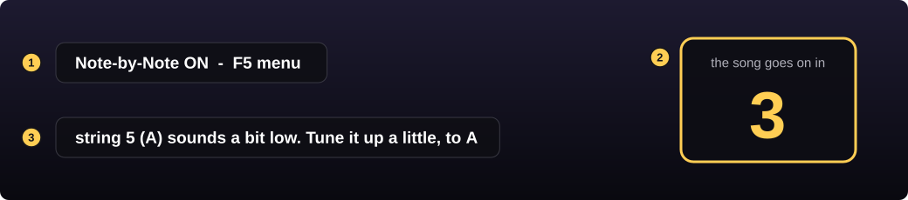

1. Short messages appear in the middle of the screen and fade: the mode switched on, a note skipped.
2. The count-in after a long wait, under the banner: the beats left before the song goes on. ("Count-in after a wait", Playing page.)
3. A string that sounds out of tune, and which way to turn it. ("Tell me when my guitar sounds out of tune", Playing page.)

## The tab

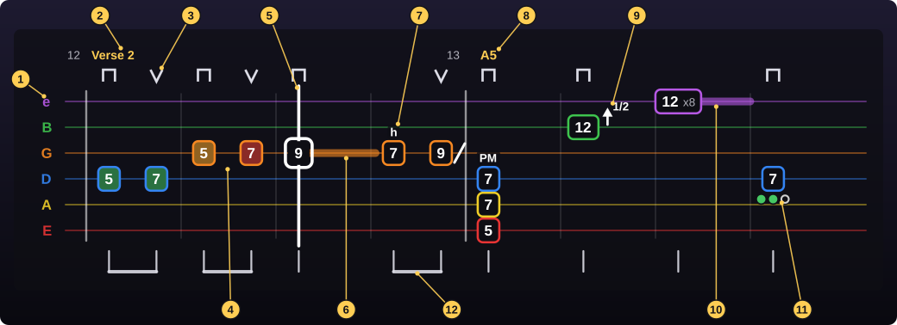

A new install shows the tab without the pick strokes (3) and the rhythm (12): both are switched on on the Tab page.

1. **The strings**, by letter and colour. Thinnest on top, like printed tab. ("Thickest string on top" and "Left-handed (right to left)", Tab page.)
2. **Bar numbers**, and the name of a section where it starts. (The bar and beat lines with their numbers: "Bar and beat lines", Tab page.)
3. **Pick strokes**: down or up. The song's own are a little stronger than suggested ones. ("Show which way to pick", Tab page.)
4. **Notes you have passed** get a colour: green = played on time, amber = the song waited for it, red = skipped, or not played in "Show the notes". ("Colour the notes you played", Tab page.)
5. **The cursor**: where the song is. It stops exactly on the note the song is waiting for.
6. **The note to play** has a white frame. A coloured tail after a note shows how long it rings.
7. **Technique marks**: a letter above the note, or a slanted line after it for a slide (see [The marks](#the-marks)).
8. **A chord**: its notes one above the other, with its name on top. A mark shared by the whole chord is written once above it.
9. **A bend**: an arrow up, and how far.
10. **A fast repeat** of one fret is written once: "12 x8" means fret 12, eight more times. The number counts down. ("Spread out fast notes", Tab page; off, every note is written at its exact time.)
11. **Progress dots**: under every note you have not yet played on time enough times in a row, so a new song has them from its first note, and under a note that went wrong before. One fills green each time you play it on time; when all are green the note is cleared (see [Trouble spots](#trouble-spots)). (How many dots: "Clear a note after", Practice page.)
12. **The rhythm**: a stem under each note. Notes joined by a beam share a beat: one beam = 2 notes in a beat, two beams = 4, three = 8. A small 3 means triplets. ("Rhythm under the tab", Tab page.)

Over notes picked one by one inside a held chord shape, the tab draws a thin gold bracket with the chord's name.

How much music the tab shows is "Seconds ahead" (2 to 8), the size of its numbers "Note size", and how solid its background is "Background" (all on the Tab page). Its width and height change by dragging its corner.

### Pages or scrolling

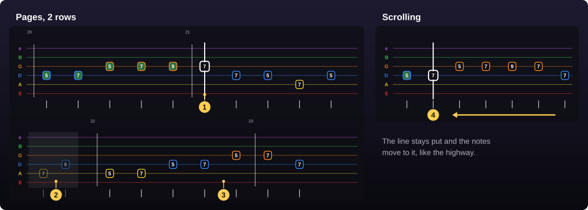

1. **Pages**: the notes stand still and the cursor moves over them. This is the easier one to read in fast parts. ("Pages" or "Scrolling", Tab page.)
2. Each new page starts by repeating the end of the page before, so you see where you came from; on rows still to come it is dimmed. (How much is repeated: "Repeat previous page", 0 to 50 % of the width, Tab page.)
3. With 2 to 4 rows ("Rows", Tab page), the next page is already waiting in the row below. When the cursor reaches the end of a row your eyes move down, and the row it left gets the page after the last one. There is no page turn to wait for.
4. **Scrolling**: the line stays put and the notes move to it, like the highway.

More rows make the tab taller: drag its corner to resize it.

## Practising a part

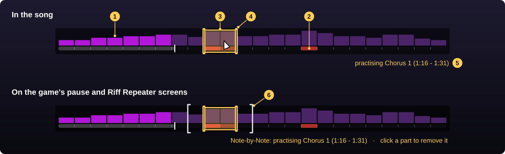

The practice bar sits on the game's progress bar and works with the mouse, with the menu closed or open. Note-by-Note then waits only inside the parts you marked; the rest of the song plays through. ("Practice bar", Screen page.)

1. The game's bar: one block for each phrase of the song.
2. **Red** = where the song had to wait for you most (your trouble spots).
3. **A practice part**, in gold. Click a phrase to mark it, or drag over any stretch of the song. You can mark several.
4. **Its ends**: drag one to make the part longer or shorter. Click inside a part to remove it.
5. The line under the bar says what is being practised.
6. On the game's **pause** and **Riff Repeater** screens the bar works the same way, beside the game's own selection. The line there starts with "Note-by-Note:" so you can tell the two apart.

Practice parts belong to the song you are playing: a new song starts with none.

### With Riff Repeater

Riff Repeater is the game's own loop: it plays a section again and again, slower if you like. Note-by-Note works inside it. Mark the same section as a practice part and you get both: the game repeats it, and Note-by-Note waits for each note in it.

You can set or remove the practice part on the Riff Repeater screen itself, so there is no need to go back into the song to change it.

### Trouble spots

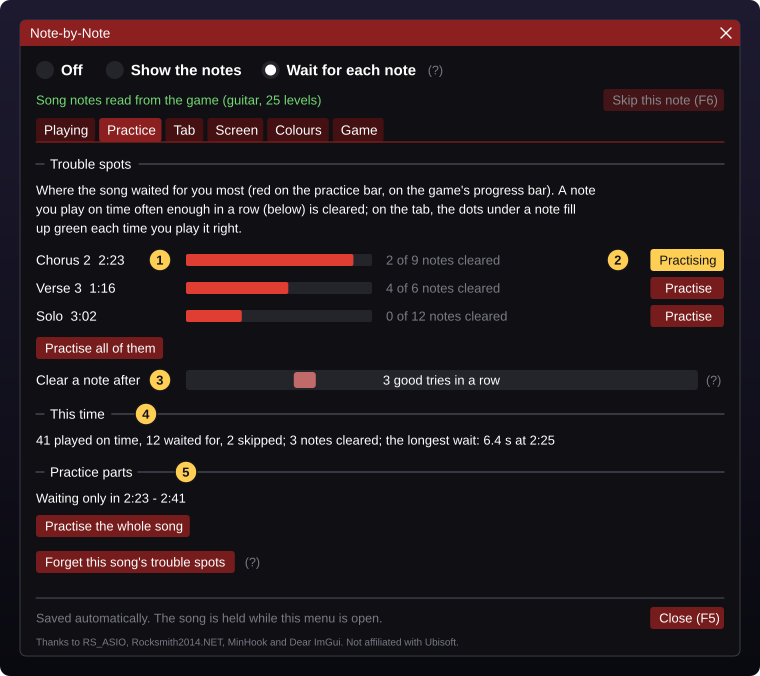

Note-by-Note remembers, for each song and arrangement, where the song had to wait for you. Longer waits and skipped notes count more. The record is kept between sessions.

1. **The phrases where you stopped most**, the hardest first, named by section and time. The red bar shows how much.
2. **Practise** is a switch. Click it and that phrase becomes a practice part: the button turns gold and says "Practising". Click it again to take the phrase out. You can switch on as many as you like, and "Practise all of them" switches them all on. The practice bar stays in view and keeps working while the menu is open, so you see the parts you chose at once and can change them on the bar too. If the menu covers the end of the bar, drag the menu aside by its title bar.
3. **Clearing a note**: play it on time this many times in a row (3 to begin with; "Clear a note after", 1 to 10) and it no longer counts as trouble. Going wrong again starts the count over. On the tab you can watch it happen: the dots under the note fill up.
4. **This time**: how this run of the song went.
5. **The practice parts** now marked, and a button to go back to the whole song.

"Forget this song's trouble spots" starts this song's record again.

## The menu

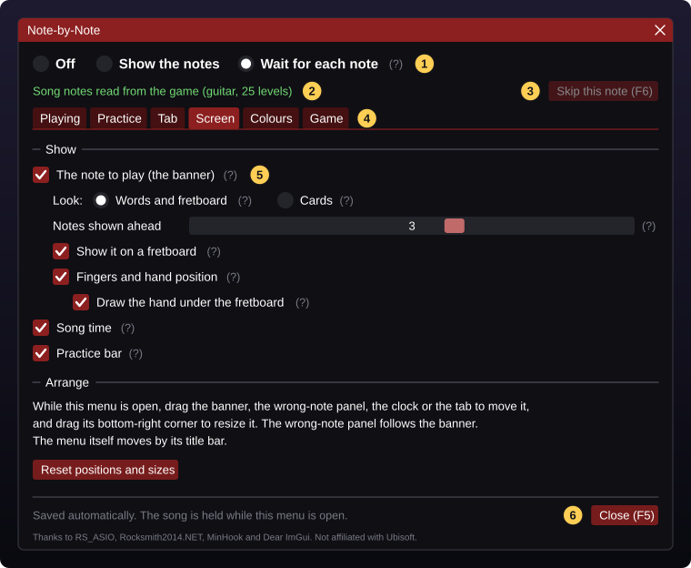

Press **F8** during a song. The song is held while the menu is open, and everything you change is saved at once.

1. **The mode**: Off, Show the notes, Wait for each note.
2. **The song line**: green when the song's notes were read, with the instrument and how many difficulty levels the song has.
3. **Skip**: the same as F9.
4. **The pages**, one for each topic.
5. **(?)**: rest the mouse on it for an explanation of the option.
6. **Close**: or press F8 or Esc.

### Playing page

| Option | What it does | Starts |
|---|---|---|
| Wait for chords too | Off: the song only waits for single notes, chords pass by themselves. | on |
| Don't wait again for greyed-out notes | When you come back from the game's pause screen, the game goes back a few seconds and replays them with the notes greyed out. On: the song does not stop for those again. | on |
| Accept the same note an octave higher or lower | For playing a riff in another position. Off is stricter. | off |
| Tell me when my guitar sounds out of tune | See [Out of tune](#out-of-tune). | on |
| Early notes count | A right note played up to this early counts. | 300 ms |
| Late notes count | A right note played up to this late counts; the song stops only after that. 0 = off. | 150 ms |
| Stop before the note | Only with "Late notes count" off: the song stops this long before the note. | 30 ms |
| Count-in after a wait | Beats counted before the song goes on after a long wait. 0 = off. | 3 beats |
| Show where you really played it | See [Showing where you really played it](#showing-where-you-really-played-it). Needs Calibrate. | on |

### Practice page

See [Trouble spots](#trouble-spots).

### Tab page

| Option | What it does | Starts |
|---|---|---|
| Show the notes coming up as tab | The whole tab on or off. | on |
| Pages / Scrolling | See [Pages or scrolling](#pages-or-scrolling). | Pages |
| Rows | Pages only: 1 to 4 rows. | 1 |
| Seconds ahead | How much music the tab shows. | 4 s |
| Repeat previous page | How much of the page before a new page repeats on its left. | 8 % |
| Bar and beat lines | Bar lines with numbers, and faint lines on the beats. | on |
| Rhythm under the tab | The stems and beams. | off |
| Spread out fast notes | Fast parts get more room, and a fast repeat is written once ("12 x8"). Off: spacing exactly by time. | on |
| Show which way to pick | The pick strokes, on the tab and on the banner. | off |
| Colour the notes you played | Green, amber and red on the notes you passed. | on |
| Thickest string on top | For example if you play a flipped guitar. | off |
| Left-handed (right to left) | Time runs from right to left. | off |
| Number the strings from the thickest | String 1 becomes the thickest. | off |
| Standard layout (like printed tab) | A button: puts the two options above back. | |
| Note size | Size of the fret numbers. | 100 % |
| Background | 0 = see-through, 100 = solid. | 69 % |

### Screen page

| Option | What it does | Starts |
|---|---|---|
| The note to play (the banner) | The banner on or off. In "Show the notes" it is always on. | on |
| Look | Words and fretboard, or Cards. | Words and fretboard |
| Notes shown ahead | How many of the next notes the banner shows, 0 to 5. Choosing the Cards look sets it to 3 if it was 0. | 0 |
| Show it on a fretboard | Off: the picture is a small tab instead. Words look only. | on |
| Fingers and hand position | Finger numbers, the shaded frets, and "Hand: move UP to fret 7". | off |
| Draw the hand under the fretboard | With "Fingers and hand position" on. Off: only the finger numbers on the dots. Words look only. | on |
| Song time | The clock. | on |
| Practice bar | See [Practising a part](#practising-a-part). | on |

### Colours page

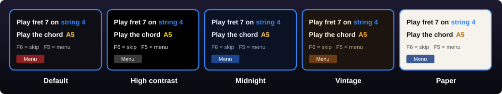

Pick one of five themes, then change any single colour if you like: click its square for a colour wheel, or type a colour code. "Reset" puts a colour back to the theme's.

The string colours never change: they are the game's, so the banner and the highway always agree. With the Paper theme, set the tab's background to 90 % or more so the game does not show through.

### Game page

These apply from the next time you start the game.

| Option | What it does | Starts |
|---|---|---|
| Close the Ubisoft login and server popups | Answers those dialogs by itself. "Press Enter" and the choice of profile stay yours. | on |
| Play the start-up logos 4x faster | Shorter wait before the title screen. | off |
| Avoid the game's own random crash / freeze | Fixes a crash of the game that happens mostly at start-up. | on |

### Moving and resizing

While the menu is open, drag the banner, the wrong-note panel, the clock or the tab to move it, and drag its bottom-right corner to resize it. The wrong-note panel follows the banner. The menu itself moves by its title bar.

"Reset positions and sizes" on the Screen page puts everything back.

## Files

All of these are in the game's folder.

| File | What it is |
|---|---|
| `NoteByNote.ini` | Your settings. The menu writes it; you can also edit it with Notepad while the game is closed. The menu and skip keys can only be changed here (`MenuKey`, `SkipKey`). |
| `NoteByNote_stats` | A folder with your trouble spots, one small file for each song and arrangement. |
| `NoteByNote.log` | What the mod did in the last session. Useful when you report a problem. |

## If something is not right

- **Nothing shows in the game.** Look at `NoteByNote.log`. "UNSUPPORTED game version" means your copy of the game is a version the mod does not know, and it stays switched off there.
- **"Couldn't read this song's notes, it plays normally."** Go back to the song list, pick the song again and start it. If it keeps happening with one song, report it with the log.
- **The song stops although I played the note.** Check the tuning first: a string a little off is the usual reason. Then make "Late notes count" longer. A very distorted sound is harder to hear right, so try a cleaner one.
- **The song stops for an instant at every note.** "Late notes count" is at 0 or too short. Put it back to 150 ms.
- **It waits for a chord I cannot play yet.** Switch off "Wait for chords too", or press F9 to skip it.
- **The banner covers something.** Open the menu and drag it somewhere else, or make it smaller by its corner.
- **I want only the tab, without the song stopping.** Choose Off: the tab and the clock stay.

## Supporting the development

Note-by-Note is free and made in spare time. These are the things that help it most:

- **Tell what you find.** A note it did not hear, advice that was wrong, something hard to read on screen: open an issue on [the project's GitHub page](https://github.com/Arkhanragel/note-by-note-rocksmith2014/issues) and say what happened and in which song. Attach `NoteByNote.log` from the game's folder; it has no personal data.
- **Test the older game version.** If you play the Rocksmith 2014 Remastered of September 2022, the mod needs someone with that version to try it. It takes about 10 minutes and no guitar; the README on the project's page has the steps.
- **Share your ideas.** Many things in the mod started as a player's remark: the cards, the switches on the Practice page, the practice bar on the Riff Repeater screen.
- **Tell other players**, and give the project a star [on GitHub](https://github.com/Arkhanragel/note-by-note-rocksmith2014) so they can find it.
- **Buy me a coffee**, if the mod helped you and you feel like it: [ko-fi.com/arkhanragel](https://ko-fi.com/arkhanragel). It is entirely optional. Note-by-Note is free and always will be, and nothing is locked behind a tip.

## Special thanks

Note-by-Note stands on other people's work:

- **RS_ASIO**, by Micael Dias: it is how the mod hears your guitar.
- **RSMods** and its community, for years of research on how the game works inside.
- **Rocksmith2014.NET**, by Tapio Malmberg, used by the tools that test the mod.
- **Dear ImGui**, by Omar Cornut, which draws everything you see, and **MinHook**, by Tsuda Kageyu.
- **Everyone who tests it** and takes the time to report what they find.
- And the people who made **Rocksmith 2014**, a game still worth building for after all these years.

Note-by-Note is not affiliated with or endorsed by Ubisoft. Rocksmith is a trademark of Ubisoft Entertainment.
